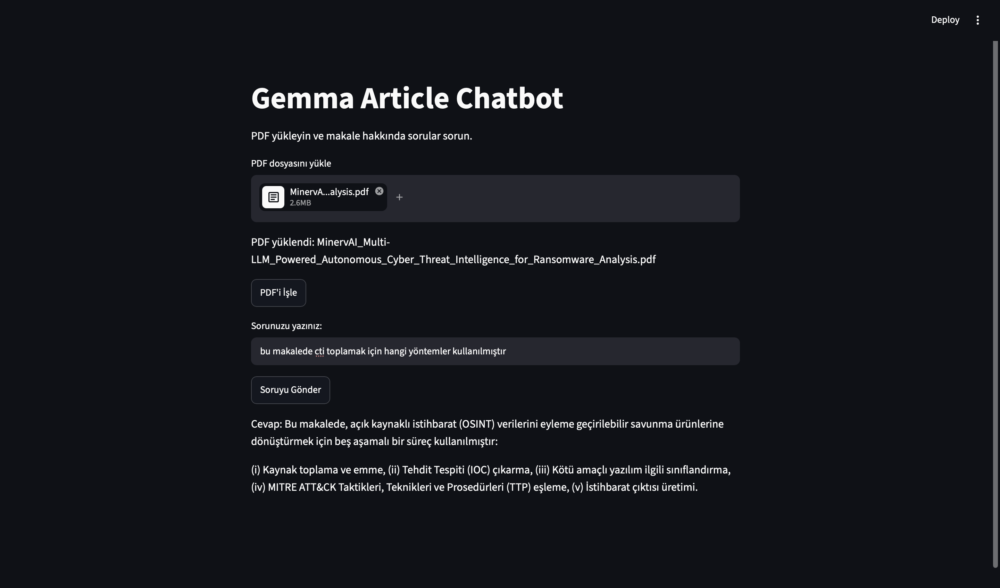
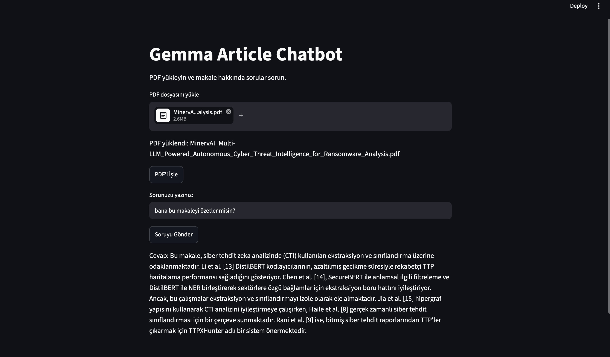

# 📄 Gemma Article Chatbot (RAG Assistant)

Kullanıcıların yükledikleri PDF formatındaki araştırma ve akademik makaleleri vektör tabanına indeksleyerek, içerikten özet çıkarabilen ve bağlama dayalı sorulara nokta atışı yanıt verebilen **RAG (Retrieval-Augmented Generation)** tabanlı yerel asistan.

## 📸 Ekran Görüntüleri ve Örnek Kullanım (Screenshots & Demo)

Aşağıda **MinervAI: Multi-LLM Powered Autonomous Cyber Threat Intelligence for Ransomware Analysis** makalesi üzerinden yapılan test ve örnek soru-cevap çıktıları yer almaktadır:

### 1. Makale Genel Özeti

Kullanıcı makalenin genel özetini talep ettiğinde RAG hattı literatür ve çalışma kapsamını analiz ederek özetler:



### 2. Spesifik Yöntem / Metodoloji Sorgusu

Makale içerisindeki adımlar, aşamalar ve metodolojiye yönelik doğrudan bilgi çıkarımı:



## 🚀 Temel Özellikler

* **Gizlilik Odaklı & Tamamen Yerel:** Ollama üzerinden koşan **Gemma 3 (4B)** modeli sayesinde analiz edilen dokümanlar üçüncü taraf harici API'lere gönderilmez.

* **Hızlı Benzerlik Araması:** Vektör benzerlik aramaları için optimize edilmiş **FAISS CPU** indeksi.

* **Çok Dilli Embedding:** Semantik temsil ve metin vektörleştirme için **sentence-transformers/LaBSE** kullanımı.

* **Ayrık Servis Mimarisi:**

  * **Backend (FastAPI):** PDF işleme, chunking, embedding çıkarma ve RAG pipeline yönetimi.

  * **Frontend (Streamlit):** Kolay dosya yükleme ve gerçek zamanlı soru-cevap arayüzü.

* **Sohbet Hafızası (Memory):** Önceki soruları ve yanıtları bağlamda tutabilen konuşma geçmişi desteği.

## 🛠️ Teknolojiler & Kütüphaneler

| **Bileşen** | **Teknoloji / Kütüphane** | 
| **Dil Modeli (LLM)** | Gemma 3 (4B) via Ollama | 
| **Orchestration** | LangChain / LangChain Community | 
| **Vektör Veritabanı** | FAISS (CPU) | 
| **Embedding Modeli** | `sentence-transformers/LaBSE` | 
| **Backend API** | FastAPI, Uvicorn | 
| **Kullanıcı Arayüzü** | Streamlit | 
| **PDF Loader** | PyPDFLoader | 

## 📂 Proje Dizin Yapısı

```
article_rag/
├── docs/
│   └── que1.jpg          # Örnek soru-cevap ekran görüntüsü
│   └── que2.jpg          # Örnek özet ekran görüntüsü
├── main.py                   # FastAPI backend & RAG pipeline
├── streamlit.py              # Streamlit kullanıcı arayüzü
├── requirements.txt          # Python bağımlılıkları
├── .gitignore                # Takip dışı bırakılan dosyalar (venv vb.)
└── README.md                 # Proje dokümantasyonu

```

## 📦 Kurulum ve Çalıştırma

### 1. Depoyu Klonlayın

```
git clone https://github.com/miracmuberragul/article_summarizer.git
cd article_summarizer

```

### 2. Sanal Ortam Oluşturun ve Aktif Edin

```
# macOS / Linux
python3 -m venv venv
source venv/bin/activate

# Windows
python -m venv venv
venv\Scripts\activate

```

### 3. Bağımlılıkları Yükleyin

```
pip install -r requirements.txt

```

### 4. Modeli Ollama Üzerinden İndirin

Sisteminizde [Ollama](https://ollama.com)'nın kurulu ve arka planda açık olduğundan emin olun:

```
ollama run gemma3:4b

```

## 🚦 Servisleri Başlatma

Sistem iki ayrı servisin eş zamanlı çalışmasıyla işler:

### 1. Adım: FastAPI Backend Sunucusunu Başlatın

Terminal 1 üzerinde API servisini ayağa kaldırın:

```
uvicorn main:app --reload --port 8000

```

*Backend `http://localhost:8000` adresinde çalışacaktır. Swagger dokümantasyonuna `http://localhost:8000/docs` üzerinden erişebilirsiniz.*

### 2. Adım: Streamlit Arayüzünü Başlatın

Terminal 2 üzerinde (yine venv aktifken) arayüzü çalıştırın:

```
streamlit run streamlit.py

```

*Arayüz tarayıcınızda otomatik olarak `http://localhost:8501` adresinde açılacaktır.*

## ⚙️ Mimarinin Çalışma Mantığı (RAG Akışı)

```
+----------------+      PyPDFLoader       +-------------------+
|  PDF Makalesi  | ---------------------> | Ham Metin Verisi  |
+----------------+                        +-------------------+
                                                    |
                                    RecursiveCharacterTextSplitter
                                                    v
                                          +-------------------+
                                          | Metin Parçaları   |
                                          | (Chunk Boyutu)    |
                                          +-------------------+
                                                    |
                                             LaBSE Embeddings
                                                    v
                                          +-------------------+
                                          | FAISS Vektör DB   |
                                          +-------------------+
                                                    |
[ Kullanıcı Sorusu ]                                |
         |                                          v
         +------------> [ ConversationalRetrieval ] <+ (En alakalı k=3 chunk)
                                  |
                                  v
                        [ Ollama: gemma3:4b ]
                                  |
                                  v
                         [ Yanıt / Özet ]

```

## 📌 Lisans

Bu proje açık kaynaklıdır ve eğitim/araştırma amaçlı geliştirmeye uygundur.
